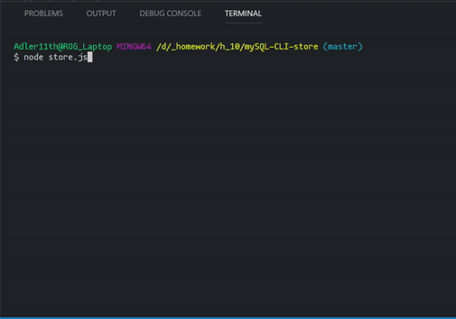
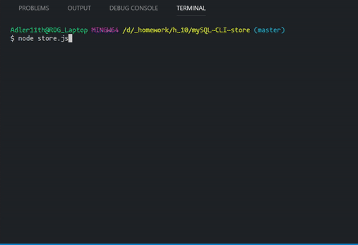
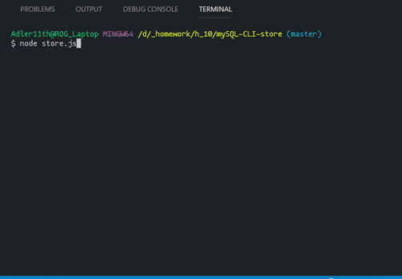

# mySQL-CLI-store

CLI store application whritten in JS for Nodejs that works with mySLQ database to process and hold data. 

Dependencies:
    * mySQL - to cennect and query mySQL database;
    * inquirer - for user interface;
    * cli-table - to display mySQL responses in table format in terminal;

## Customer.js

This modue allows customers to purchase any product from store inventory(mySQL table). The application also updates mySQL table porduct quantity column and calculates total sales for product.

## Manager.js

Manager module works with the same mySQL database to perform duties such as:

    * `View Products for Sale` - the app lists every available item: the item IDs, names, prices, and quantities.

    * `View Low Inventory` -  list all items with an inventory count lower than five.

    * `Add to Inventory` - app displays a prompt that will let the manager "add more" of any item currently in the store.

    * `Add New Product`, it should allow the manager to add a completely new product to the store.

## Superviser.js

Superviser is the only person that has access to additional table in database that holds information about product departments and can perform two actions:
    * `View Product Sales by Department` - the app displays a summarized table in their terminal/bash window. Where `total_profit` column is calculated on the fly using the difference between `over_head_costs` and `product_sales`. `total_profit` is not stored in any database insteada it uses custom alias.
    * `Create New Department` - allows to enter and save new row in departments table.

**This app was created during the UC Davis Extension coding bootcamp.